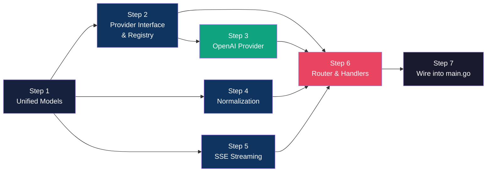
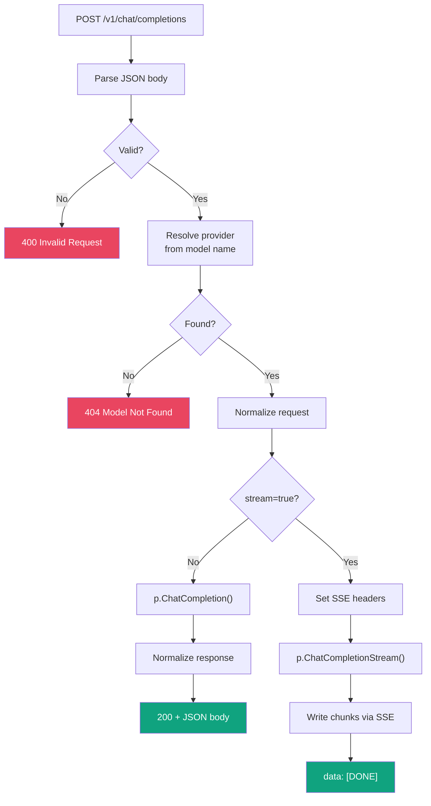

# Core Gateway Plan — From Skeleton to End-to-End

> **Prerequisite:** The [foundation_plan.md](file:///d:/LLMGateway/.agent/foundation_plan.md) is complete. We have a compiling Go project with a chi HTTP server, config loading, and stub endpoints.

> **Goal:** Turn the stub server into a **working LLM gateway** that accepts an OpenAI-format request, routes it to the correct provider, and returns a real response — both streaming and non-streaming.

---

## What This Plan Covers



> **After this plan:** `curl POST /v1/chat/completions` with an OpenAI model returns a **real** GPT response. Streaming works. The remaining providers (Anthropic, Gemini, Ollama) slot in later with no architecture changes.

---

## Project Structure After Completion

```
d:\LLMGateway\
├── cmd/
│   └── gateway/
│       └── main.go                         ← [MODIFY] Wire real router
├── configs/
│   └── gateway.yaml                        ← (unchanged)
├── internal/
│   ├── config/
│   │   └── config.go                       ← (unchanged)
│   ├── models/
│   │   ├── request.go                      ← [NEW] Unified request types
│   │   ├── response.go                     ← [NEW] Unified response types
│   │   └── errors.go                       ← [NEW] Standard error envelope
│   ├── provider/
│   │   ├── provider.go                     ← [NEW] Provider interface
│   │   ├── registry.go                     ← [NEW] Model → provider routing
│   │   └── openai/
│   │       └── openai.go                   ← [NEW] OpenAI provider
│   ├── normalize/
│   │   ├── request.go                      ← [NEW] Inbound normalization
│   │   └── response.go                     ← [NEW] Outbound normalization
│   ├── streaming/
│   │   └── sse.go                          ← [NEW] SSE read/write
│   └── router/
│       ├── router.go                       ← [NEW] Route setup
│       └── handlers.go                     ← [NEW] Endpoint handlers
├── go.mod                                  ← (unchanged)
├── go.sum                                  ← (auto-updated)
└── Makefile                                ← (unchanged)
```

**10 new files, 1 modified file.**

---

## Step 1 · Unified Models

> **Goal:** Define the canonical request/response/error types (OpenAI-compatible) used across the entire gateway.

### [NEW] `internal/models/request.go`

```go
package models

// ChatCompletionRequest is the unified inbound request type.
// It mirrors the OpenAI chat completions API.
type ChatCompletionRequest struct {
    Model       string    `json:"model"`
    Messages    []Message `json:"messages"`
    Temperature *float64  `json:"temperature,omitempty"`
    MaxTokens   *int      `json:"max_tokens,omitempty"`
    Stream      bool      `json:"stream,omitempty"`
    Provider    string    `json:"provider,omitempty"` // explicit provider override
}

// Message represents one message in the conversation.
type Message struct {
    Role    string `json:"role"`    // "system", "user", "assistant"
    Content string `json:"content"`
}

// Role constants.
const (
    RoleSystem    = "system"
    RoleUser      = "user"
    RoleAssistant = "assistant"
)
```

#### Line-by-line breakdown

| Field | Type | Why |
|-------|------|-----|
| `Model` | `string` | The model identifier (e.g. `"gpt-4o"`, `"claude-3.5-sonnet"`). The registry uses this to route to the correct provider. |
| `Messages` | `[]Message` | The conversation history. OpenAI, Anthropic, Gemini, and Ollama all take an array of messages, though the format varies — that's what the normalization layer handles. |
| `Temperature` | `*float64` | **Pointer** because `0.0` is a valid temperature but the zero value of `float64` is also `0.0`. A pointer lets us distinguish "user set temperature to 0" from "user didn't set temperature". `omitempty` omits the field from JSON when nil. |
| `MaxTokens` | `*int` | Same reasoning as `Temperature`. Anthropic *requires* `max_tokens`, so the normalization layer will default this to 4096 if nil. |
| `Stream` | `bool` | `false` by default (Go zero value). If `true`, the handler switches to SSE streaming mode. |
| `Provider` | `string` | Optional override — if set, bypasses prefix-based routing. Allows `"provider":"openai"` to force routing even for ambiguous model names. |

---

### [NEW] `internal/models/response.go`

This file defines **all outbound types** — the shapes returned to the client. There are three groups:

1. **Non-streaming response** (`ChatCompletionResponse`, `Choice`, `Usage`)
2. **Streaming response** (`StreamChunk`, `StreamDelta`, `Delta`)
3. **Model listing** (`ModelInfo`, `ModelListResponse`)

```go
package models

// ChatCompletionResponse is the unified response type (OpenAI format).
type ChatCompletionResponse struct {
    ID      string   `json:"id"`
    Object  string   `json:"object"`   // always "chat.completion"
    Created int64    `json:"created"`
    Model   string   `json:"model"`
    Choices []Choice `json:"choices"`
    Usage   *Usage   `json:"usage,omitempty"`
}

// Choice represents one completion choice.
type Choice struct {
    Index        int      `json:"index"`
    Message      Message  `json:"message"`
    FinishReason string   `json:"finish_reason"` // "stop", "length", etc.
}

// Usage holds token counts.
type Usage struct {
    PromptTokens     int `json:"prompt_tokens"`
    CompletionTokens int `json:"completion_tokens"`
    TotalTokens      int `json:"total_tokens"`
}

// StreamChunk is one SSE event during streaming.
type StreamChunk struct {
    ID      string        `json:"id"`
    Object  string        `json:"object"` // "chat.completion.chunk"
    Created int64         `json:"created"`
    Model   string        `json:"model"`
    Choices []StreamDelta `json:"choices"`
}

// StreamDelta is a single delta within a stream chunk.
type StreamDelta struct {
    Index        int    `json:"index"`
    Delta        Delta  `json:"delta"`
    FinishReason string `json:"finish_reason,omitempty"`
}

// Delta holds the incremental content during streaming.
type Delta struct {
    Role    string `json:"role,omitempty"`
    Content string `json:"content,omitempty"`
}

// ModelInfo represents a model in the /v1/models list.
type ModelInfo struct {
    ID      string `json:"id"`
    Object  string `json:"object"` // "model"
    OwnedBy string `json:"owned_by"`
}

// ModelListResponse is the response for GET /v1/models.
type ModelListResponse struct {
    Object string      `json:"object"` // "list"
    Data   []ModelInfo `json:"data"`
}
```

#### Group 1 — Non-Streaming Response

##### `ChatCompletionResponse`

This is the top-level JSON object returned for a non-streaming `POST /v1/chat/completions` call.

| Field | Type | Why this type | Example value |
|-------|------|---------------|---------------|
| `ID` | `string` | Unique completion ID assigned by the provider. Opaque string; clients use it for logging/debugging. | `"chatcmpl-abc123"` |
| `Object` | `string` | Always `"chat.completion"` for non-streaming. OpenAI clients check this field to distinguish response types. | `"chat.completion"` |
| `Created` | `int64` | Unix timestamp (seconds since epoch). `int64` avoids overflow and matches OpenAI's API. Not a `time.Time` because JSON serialization of timestamps varies; unix seconds are universal. | `1709000000` |
| `Model` | `string` | The actual model that served the request. May differ from what was requested (e.g., `"gpt-4o-2024-08-06"` when you asked for `"gpt-4o"`). | `"gpt-4o-2024-08-06"` |
| `Choices` | `[]Choice` | An array of completions. Most requests produce exactly 1 choice, but the OpenAI API supports `n > 1` for multiple completions. We use a slice to stay compatible. | `[{index: 0, message: {...}, finish_reason: "stop"}]` |
| `Usage` | `*Usage` | **Pointer** so we can omit it with `omitempty`. During streaming, OpenAI doesn't include usage by default — a nil pointer serializes to nothing. For non-streaming, it's always populated. | `{prompt_tokens: 10, completion_tokens: 5, total_tokens: 15}` |

##### `Choice`

Each element in the `Choices` array:

| Field | Type | Why this type | Example value |
|-------|------|---------------|---------------|
| `Index` | `int` | Zero-based index identifying which choice this is (matters when `n > 1`). | `0` |
| `Message` | `Message` | The full assistant message. Reuses the same `Message` type from `request.go` — both have `role` + `content`. The response message always has `role: "assistant"`. | `{role: "assistant", content: "Hello!"}` |
| `FinishReason` | `string` | Why the model stopped generating. **Not a pointer** — non-streaming always has a finish reason. Common values: `"stop"` (natural end), `"length"` (hit max_tokens), `"content_filter"` (blocked). | `"stop"` |

##### `Usage`

Token accounting for billing and debugging:

| Field | Type | Why | Example |
|-------|------|-----|---------|
| `PromptTokens` | `int` | Number of tokens in the input messages. Useful for cost estimation. | `12` |
| `CompletionTokens` | `int` | Number of tokens the model generated. | `8` |
| `TotalTokens` | `int` | `PromptTokens + CompletionTokens`. Redundant but included because OpenAI's API returns it and some clients rely on it. | `20` |

#### Group 2 — Streaming Response

Streaming uses **Server-Sent Events (SSE)**. Each SSE event carries one `StreamChunk` as JSON. These are *structurally different* from `ChatCompletionResponse` — not just a subset.

##### Why separate types instead of reusing `ChatCompletionResponse`?

| Non-streaming | Streaming |
|---------------|-----------|
| `"object": "chat.completion"` | `"object": "chat.completion.chunk"` |
| `choices[].message` (full message) | `choices[].delta` (incremental fragment) |
| `finish_reason` always present | `finish_reason` only on the **last** chunk |
| `usage` included | `usage` typically absent |
| Single JSON response | Many SSE events over time |

Combining these into one type would require too many optional fields and confusing conditional logic. Separate types make the code self-documenting.

##### `StreamChunk`

One SSE `data:` event:

| Field | Type | Why | Example |
|-------|------|-----|---------|
| `ID` | `string` | Same completion ID across all chunks for one request. Lets clients correlate chunks. | `"chatcmpl-abc123"` |
| `Object` | `string` | Always `"chat.completion.chunk"`. Clients distinguish streaming vs non-streaming by this field. | `"chat.completion.chunk"` |
| `Created` | `int64` | Same timestamp across all chunks. | `1709000000` |
| `Model` | `string` | Same model across all chunks. | `"gpt-4o"` |
| `Choices` | `[]StreamDelta` | Uses `StreamDelta` (not `Choice`) because the inner structure differs. | `[{index: 0, delta: {content: "Hel"}}]` |

##### `StreamDelta`

One delta within a stream chunk:

| Field | Type | Why | Example |
|-------|------|-----|---------|
| `Index` | `int` | Which choice this delta belongs to (usually `0`). | `0` |
| `Delta` | `Delta` | The incremental content. Uses a separate `Delta` type (not `Message`) because `role` and `content` are both optional during streaming. | `{content: "lo"}` |
| `FinishReason` | `string` | **Uses `omitempty`** — only the **last** chunk has a finish reason (e.g., `"stop"`). All prior chunks leave this empty, and `omitempty` ensures it's omitted from JSON entirely (not sent as `"finish_reason": ""`). | `"stop"` (last chunk only) |

##### `Delta`

The incremental content fragment:

| Field | Type | Why `omitempty` | When present |
|-------|------|-----------------|-------------|
| `Role` | `string` | Only the **first** chunk carries `role: "assistant"`. All subsequent chunks omit it. Without `omitempty`, every chunk would send `"role": ""`. | First chunk only |
| `Content` | `string` | Each chunk carries a few tokens of content. The last chunk may have empty content (just a `finish_reason`). `omitempty` avoids sending `"content": ""`. | Most chunks |

**Typical stream sequence:**
```
data: {"choices":[{"delta":{"role":"assistant","content":""},"index":0}]}    ← first chunk (role set)
data: {"choices":[{"delta":{"content":"Hello"},"index":0}]}                 ← content chunks
data: {"choices":[{"delta":{"content":"!"},"index":0}]}                     ← more content
data: {"choices":[{"delta":{},"index":0,"finish_reason":"stop"}]}           ← last chunk
data: [DONE]                                                                 ← end marker
```

#### Group 3 — Model Listing

##### `ModelInfo`

Represents a single model in the `/v1/models` endpoint:

| Field | Type | Why | Example |
|-------|------|-----|---------|
| `ID` | `string` | The model identifier clients use in requests. | `"gpt-4o"` |
| `Object` | `string` | Always `"model"`. OpenAI convention for resource type tagging. | `"model"` |
| `OwnedBy` | `string` | The provider/organization that owns the model. | `"openai"` |

##### `ModelListResponse`

The top-level response for `GET /v1/models`:

| Field | Type | Why | Example |
|-------|------|-----|---------|
| `Object` | `string` | Always `"list"`. OpenAI's convention for paginated/list endpoints. | `"list"` |
| `Data` | `[]ModelInfo` | All available models aggregated from every registered provider. | `[{id: "gpt-4o", ...}, ...]` |

#### ⚠️ Current status of `response.go`

Your current `internal/models/response.go` has `ChatCompletionResponse`, `Choice`, and `Usage` — **Group 1 is done**. You still need to add:

- **Group 2**: `StreamChunk`, `StreamDelta`, `Delta` — required for SSE streaming (Step 5)
- **Group 3**: `ModelInfo`, `ModelListResponse` — required for `GET /v1/models` handler (Step 6)

---

### [NEW] `internal/models/errors.go`

```go
package models

import (
    "encoding/json"
    "net/http"
)

// ErrorResponse is the standard error envelope (matches OpenAI's format).
type ErrorResponse struct {
    Error ErrorDetail `json:"error"`
}

// ErrorDetail holds the error information.
type ErrorDetail struct {
    Message string `json:"message"`
    Type    string `json:"type"`
    Code    string `json:"code"`
}

// WriteError writes a JSON error response to w with the given HTTP status.
func WriteError(w http.ResponseWriter, status int, message, errType, code string) {
    w.Header().Set("Content-Type", "application/json")
    w.WriteHeader(status)
    json.NewEncoder(w).Encode(ErrorResponse{
        Error: ErrorDetail{
            Message: message,
            Type:    errType,
            Code:    code,
        },
    })
}

// Common error helpers.

func WriteInvalidRequest(w http.ResponseWriter, message string) {
    WriteError(w, http.StatusBadRequest, message, "invalid_request_error", "invalid_request")
}

func WriteProviderError(w http.ResponseWriter, message string) {
    WriteError(w, http.StatusBadGateway, message, "upstream_error", "provider_error")
}

func WriteNotFound(w http.ResponseWriter, message string) {
    WriteError(w, http.StatusNotFound, message, "invalid_request_error", "model_not_found")
}
```

#### Why `WriteError` helpers?

Every handler needs to write JSON errors. Without these helpers, each handler would repeat the same `w.Header().Set` + `w.WriteHeader` + `json.NewEncoder` boilerplate. The helpers also enforce the OpenAI error envelope format consistently.

**Done when:** `go build ./internal/models/...` compiles with no errors.

---

## Step 2 · Provider Interface & Registry

> **Goal:** Define the contract every provider must implement, and a registry that maps model names to providers.

### [NEW] `internal/provider/provider.go`

```go
package provider

import (
    "context"

    "github.com/nglong14/llmgateway/internal/models"
)

// Provider is the interface every LLM provider must implement.
type Provider interface {
    // Name returns the provider identifier (e.g. "openai", "anthropic").
    Name() string

    // ChatCompletion sends a non-streaming chat request.
    ChatCompletion(ctx context.Context, req *models.ChatCompletionRequest) (*models.ChatCompletionResponse, error)

    // ChatCompletionStream sends a streaming chat request.
    // Returns a channel of chunks and a channel for any error.
    // The chunks channel is closed when streaming is complete.
    ChatCompletionStream(ctx context.Context, req *models.ChatCompletionRequest) (<-chan *models.StreamChunk, <-chan error)

    // ListModels returns model IDs available from this provider.
    ListModels(ctx context.Context) ([]models.ModelInfo, error)

    // HealthCheck verifies the provider is reachable.
    HealthCheck(ctx context.Context) error
}
```

#### Why an interface?

Each provider (OpenAI, Anthropic, Gemini, Ollama) has a wildly different API surface — different request shapes, authentication schemes, streaming formats. The `Provider` interface hides all of that behind a unified contract. The handlers in `internal/router/handlers.go` never know which provider they're talking to — they just call `ChatCompletion()` or `ChatCompletionStream()`.

#### Why channels for streaming?

Go channels are the idiomatic way to produce a sequence of values over time. The handler reads from the chunks channel and writes each chunk to the HTTP response as an SSE event. The error channel carries any error that occurs mid-stream (network errors, parse errors). Using two channels avoids mixing data and errors in a single channel, which would require a wrapper type.

---

### [NEW] `internal/provider/registry.go`

```go
package provider

import (
    "fmt"
    "strings"
    "sync"
)

// Registry maps model names/prefixes to providers.
type Registry struct {
    mu        sync.RWMutex
    providers map[string]Provider // name → provider
    prefixes  []prefixEntry       // ordered prefix rules
}

type prefixEntry struct {
    prefix   string
    provider Provider
}

// NewRegistry creates an empty registry.
func NewRegistry() *Registry {
    return &Registry{
        providers: make(map[string]Provider),
    }
}

// Register adds a provider and its model prefixes to the registry.
func (r *Registry) Register(p Provider, prefixes ...string) {
    r.mu.Lock()
    defer r.mu.Unlock()
    r.providers[p.Name()] = p
    for _, prefix := range prefixes {
        r.prefixes = append(r.prefixes, prefixEntry{prefix: prefix, provider: p})
    }
}

// Resolve finds the provider for a given model name.
// Priority:
//  1. Explicit "provider" field in the request (looked up by name)
//  2. Model-prefix matching (e.g. "gpt-" → OpenAI)
//  3. Error if no match
func (r *Registry) Resolve(model, explicitProvider string) (Provider, error) {
    r.mu.RLock()
    defer r.mu.RUnlock()

    // 1. Explicit provider override.
    if explicitProvider != "" {
        if p, ok := r.providers[explicitProvider]; ok {
            return p, nil
        }
        return nil, fmt.Errorf("unknown provider: %q", explicitProvider)
    }

    // 2. Prefix matching.
    for _, entry := range r.prefixes {
        if strings.HasPrefix(model, entry.prefix) {
            return entry.provider, nil
        }
    }

    return nil, fmt.Errorf("no provider found for model: %q", model)
}

// ListAll returns all registered providers.
func (r *Registry) ListAll() []Provider {
    r.mu.RLock()
    defer r.mu.RUnlock()
    result := make([]Provider, 0, len(r.providers))
    for _, p := range r.providers {
        result = append(result, p)
    }
    return result
}
```

#### Key design decisions

- **`sync.RWMutex`**: The registry is written to once at startup and read on every request — a classic read-heavy pattern. `RWMutex` allows concurrent reads without blocking.
- **Prefix-based routing**: `gpt-` → OpenAI, `claude-` → Anthropic, etc. Simple, reliable, and no external config needed. The `prefixes` slice is ordered, so first match wins.
- **Explicit provider override**: The `Provider` field in the request body (`"provider":"openai"`) takes priority over prefix matching. This handles edge cases like custom/fine-tuned models with non-standard names.
- **`ListAll`**: Used by the `/v1/models` handler to aggregate models from all providers.

**Done when:** `go build ./internal/provider/...` compiles.

---

## Step 3 · OpenAI Provider (First End-to-End)

> **Goal:** First real provider. OpenAI is the simplest because our unified format IS the OpenAI format — near-zero transformation.

### [NEW] `internal/provider/openai/openai.go`

This is the largest file in this plan. It implements all 4 methods of the `Provider` interface.

```go
package openai

import (
    "bufio"
    "bytes"
    "context"
    "encoding/json"
    "fmt"
    "io"
    "net/http"
    "strings"
    "time"

    "github.com/nglong14/llmgateway/internal/models"
)

// Client implements provider.Provider for OpenAI.
type Client struct {
    apiKey     string
    baseURL    string
    httpClient *http.Client
}

// New creates an OpenAI provider client.
func New(apiKey, baseURL string) *Client {
    return &Client{
        apiKey:  apiKey,
        baseURL: baseURL,
        httpClient: &http.Client{
            Timeout: 120 * time.Second,
        },
    }
}

func (c *Client) Name() string { return "openai" }
```

#### ChatCompletion (non-streaming)

```go
func (c *Client) ChatCompletion(ctx context.Context, req *models.ChatCompletionRequest) (*models.ChatCompletionResponse, error) {
    // 1. Build the request body (OpenAI format = our unified format).
    reqCopy := *req
    reqCopy.Stream = false
    reqCopy.Provider = "" // strip gateway-only field

    body, err := json.Marshal(reqCopy)
    if err != nil {
        return nil, fmt.Errorf("openai: marshal request: %w", err)
    }

    // 2. Create HTTP request.
    httpReq, err := http.NewRequestWithContext(ctx, http.MethodPost,
        c.baseURL+"/chat/completions", bytes.NewReader(body))
    if err != nil {
        return nil, fmt.Errorf("openai: create request: %w", err)
    }
    httpReq.Header.Set("Content-Type", "application/json")
    httpReq.Header.Set("Authorization", "Bearer "+c.apiKey)

    // 3. Send request.
    resp, err := c.httpClient.Do(httpReq)
    if err != nil {
        return nil, fmt.Errorf("openai: send request: %w", err)
    }
    defer resp.Body.Close()

    // 4. Check for HTTP errors.
    if resp.StatusCode != http.StatusOK {
        respBody, _ := io.ReadAll(resp.Body)
        return nil, fmt.Errorf("openai: API error (status %d): %s", resp.StatusCode, string(respBody))
    }

    // 5. Parse response.
    var result models.ChatCompletionResponse
    if err := json.NewDecoder(resp.Body).Decode(&result); err != nil {
        return nil, fmt.Errorf("openai: decode response: %w", err)
    }

    return &result, nil
}
```

**Why `reqCopy`?** We need to strip the `Provider` field (which is a gateway concept, not an OpenAI concept) and force `Stream: false`. Copying the struct avoids mutating the caller's request.

#### ChatCompletionStream (streaming)

```go
func (c *Client) ChatCompletionStream(ctx context.Context, req *models.ChatCompletionRequest) (<-chan *models.StreamChunk, <-chan error) {
    chunks := make(chan *models.StreamChunk, 10)
    errCh := make(chan error, 1)

    go func() {
        defer close(chunks)
        defer close(errCh)

        // 1. Build streaming request.
        reqCopy := *req
        reqCopy.Stream = true
        reqCopy.Provider = ""

        body, err := json.Marshal(reqCopy)
        if err != nil {
            errCh <- fmt.Errorf("openai: marshal request: %w", err)
            return
        }

        httpReq, err := http.NewRequestWithContext(ctx, http.MethodPost,
            c.baseURL+"/chat/completions", bytes.NewReader(body))
        if err != nil {
            errCh <- fmt.Errorf("openai: create request: %w", err)
            return
        }
        httpReq.Header.Set("Content-Type", "application/json")
        httpReq.Header.Set("Authorization", "Bearer "+c.apiKey)

        resp, err := c.httpClient.Do(httpReq)
        if err != nil {
            errCh <- fmt.Errorf("openai: send request: %w", err)
            return
        }
        defer resp.Body.Close()

        if resp.StatusCode != http.StatusOK {
            respBody, _ := io.ReadAll(resp.Body)
            errCh <- fmt.Errorf("openai: API error (status %d): %s", resp.StatusCode, string(respBody))
            return
        }

        // 2. Read SSE events line by line.
        scanner := bufio.NewScanner(resp.Body)
        for scanner.Scan() {
            line := scanner.Text()

            // Skip empty lines and non-data lines.
            if !strings.HasPrefix(line, "data: ") {
                continue
            }

            data := strings.TrimPrefix(line, "data: ")

            // The [DONE] marker signals end of stream.
            if data == "[DONE]" {
                return
            }

            // Parse the chunk.
            var chunk models.StreamChunk
            if err := json.Unmarshal([]byte(data), &chunk); err != nil {
                errCh <- fmt.Errorf("openai: decode chunk: %w", err)
                return
            }

            select {
            case chunks <- &chunk:
            case <-ctx.Done():
                return
            }
        }

        if err := scanner.Err(); err != nil {
            errCh <- fmt.Errorf("openai: read stream: %w", err)
        }
    }()

    return chunks, errCh
}
```

**Why buffered channels?**
- `chunks` has capacity 10 to prevent the goroutine from blocking on every single chunk while the handler writes to the HTTP response. This gives a small buffer for bursty chunks.
- `errCh` has capacity 1 because at most one error is sent.

#### ListModels & HealthCheck

```go
func (c *Client) ListModels(ctx context.Context) ([]models.ModelInfo, error) {
    httpReq, err := http.NewRequestWithContext(ctx, http.MethodGet,
        c.baseURL+"/models", nil)
    if err != nil {
        return nil, fmt.Errorf("openai: create request: %w", err)
    }
    httpReq.Header.Set("Authorization", "Bearer "+c.apiKey)

    resp, err := c.httpClient.Do(httpReq)
    if err != nil {
        return nil, fmt.Errorf("openai: list models: %w", err)
    }
    defer resp.Body.Close()

    if resp.StatusCode != http.StatusOK {
        return nil, fmt.Errorf("openai: list models returned status %d", resp.StatusCode)
    }

    var result struct {
        Data []models.ModelInfo `json:"data"`
    }
    if err := json.NewDecoder(resp.Body).Decode(&result); err != nil {
        return nil, fmt.Errorf("openai: decode models: %w", err)
    }

    return result.Data, nil
}

func (c *Client) HealthCheck(ctx context.Context) error {
    ctx, cancel := context.WithTimeout(ctx, 5*time.Second)
    defer cancel()
    _, err := c.ListModels(ctx)
    return err
}
```

**Done when:** `go build ./internal/provider/openai/...` compiles.

---

## Step 4 · Request & Response Normalization

> **Goal:** Placeholder normalization layer. For OpenAI, this is pass-through. For future providers, this is where format transformation happens.

### [NEW] `internal/normalize/request.go`

```go
package normalize

import "github.com/nglong14/llmgateway/internal/models"

// NormalizeRequest prepares a ChatCompletionRequest for a specific provider.
// Currently pass-through for OpenAI. Anthropic/Gemini/Ollama will need
// their own transformation branches here.
func NormalizeRequest(providerName string, req *models.ChatCompletionRequest) (*models.ChatCompletionRequest, error) {
    switch providerName {
    case "openai":
        // OpenAI format IS our unified format — no transformation needed.
        return req, nil
    default:
        // For now, pass-through. Each new provider adds a case here.
        return req, nil
    }
}
```

### [NEW] `internal/normalize/response.go`

```go
package normalize

import "github.com/nglong14/llmgateway/internal/models"

// NormalizeResponse transforms a provider-specific response into the
// unified (OpenAI-format) response.
// Currently pass-through for OpenAI.
func NormalizeResponse(providerName string, resp *models.ChatCompletionResponse) (*models.ChatCompletionResponse, error) {
    switch providerName {
    case "openai":
        return resp, nil
    default:
        return resp, nil
    }
}
```

> **Why create this now if it's pass-through?** So that the handlers call `normalize.NormalizeRequest(...)` from the start. When Anthropic is added later, we just add a `case "anthropic":` branch — no handler changes needed.

**Done when:** `go build ./internal/normalize/...` compiles.

---

## Step 5 · SSE Streaming Utilities

> **Goal:** A `streaming` package with helpers to write OpenAI-format SSE events to an HTTP response.

### [NEW] `internal/streaming/sse.go`

```go
package streaming

import (
    "encoding/json"
    "fmt"
    "net/http"

    "github.com/nglong14/llmgateway/internal/models"
)

// WriteSSEChunk writes a single SSE event containing a StreamChunk.
// Format: "data: {json}\n\n"
func WriteSSEChunk(w http.ResponseWriter, chunk *models.StreamChunk) error {
    data, err := json.Marshal(chunk)
    if err != nil {
        return fmt.Errorf("sse: marshal chunk: %w", err)
    }

    _, err = fmt.Fprintf(w, "data: %s\n\n", data)
    if err != nil {
        return fmt.Errorf("sse: write chunk: %w", err)
    }

    // Flush immediately so the client receives the event right away.
    if flusher, ok := w.(http.Flusher); ok {
        flusher.Flush()
    }

    return nil
}

// WriteSSEDone writes the final "data: [DONE]" marker.
func WriteSSEDone(w http.ResponseWriter) error {
    _, err := fmt.Fprintf(w, "data: [DONE]\n\n")
    if err != nil {
        return err
    }
    if flusher, ok := w.(http.Flusher); ok {
        flusher.Flush()
    }
    return nil
}

// SetSSEHeaders sets the required headers for SSE responses.
func SetSSEHeaders(w http.ResponseWriter) {
    w.Header().Set("Content-Type", "text/event-stream")
    w.Header().Set("Cache-Control", "no-cache")
    w.Header().Set("Connection", "keep-alive")
}
```

#### Key points

- **`http.Flusher`**: Go's `http.ResponseWriter` buffers output by default. For SSE, we need to flush after every event so the client sees it immediately. `http.Flusher` is an interface that `ResponseWriter` typically implements.
- **`data: [DONE]\n\n`**: OpenAI's convention for signaling end of stream. All compatible clients expect this.
- **`SetSSEHeaders`**: Overrides the default `application/json` content type from the middleware. SSE must be `text/event-stream`.

**Done when:** `go build ./internal/streaming/...` compiles.

---

## Step 6 · HTTP Router & Handlers

> **Goal:** Extract route setup and handlers from `main.go` into their own package. Wire up the real provider logic.

### [NEW] `internal/router/router.go`

```go
package router

import (
    "github.com/go-chi/chi/v5"
    "github.com/go-chi/chi/v5/middleware"
    "github.com/nglong14/llmgateway/internal/provider"
)

// New creates a chi router with all routes and middleware configured.
func New(registry *provider.Registry) chi.Router {
    r := chi.NewRouter()

    // Middleware.
    r.Use(middleware.Logger)
    r.Use(middleware.Recoverer)
    r.Use(middleware.SetHeader("Content-Type", "application/json"))

    // Handlers.
    h := &Handlers{registry: registry}

    // Routes.
    r.Get("/health", h.Health)
    r.Get("/v1/models", h.ListModels)
    r.Post("/v1/chat/completions", h.ChatCompletion)

    return r
}
```

### [NEW] `internal/router/handlers.go`

```go
package router

import (
    "encoding/json"
    "log"
    "net/http"

    "github.com/nglong14/llmgateway/internal/models"
    "github.com/nglong14/llmgateway/internal/normalize"
    "github.com/nglong14/llmgateway/internal/provider"
    "github.com/nglong14/llmgateway/internal/streaming"
)

// Handlers holds dependencies for all endpoint handlers.
type Handlers struct {
    registry *provider.Registry
}

// Health returns {"status":"ok"} for liveness probes.
func (h *Handlers) Health(w http.ResponseWriter, r *http.Request) {
    w.WriteHeader(http.StatusOK)
    json.NewEncoder(w).Encode(map[string]string{"status": "ok"})
}

// ListModels aggregates models from all registered providers.
func (h *Handlers) ListModels(w http.ResponseWriter, r *http.Request) {
    var allModels []models.ModelInfo

    for _, p := range h.registry.ListAll() {
        providerModels, err := p.ListModels(r.Context())
        if err != nil {
            // Log but don't fail — some providers may be down.
            log.Printf("warning: failed to list models from %s: %v", p.Name(), err)
            continue
        }
        allModels = append(allModels, providerModels...)
    }

    w.WriteHeader(http.StatusOK)
    json.NewEncoder(w).Encode(models.ModelListResponse{
        Object: "list",
        Data:   allModels,
    })
}

// ChatCompletion handles both streaming and non-streaming chat requests.
func (h *Handlers) ChatCompletion(w http.ResponseWriter, r *http.Request) {
    // 1. Parse request body.
    var req models.ChatCompletionRequest
    if err := json.NewDecoder(r.Body).Decode(&req); err != nil {
        models.WriteInvalidRequest(w, "invalid JSON: "+err.Error())
        return
    }

    // 2. Validate required fields.
    if req.Model == "" {
        models.WriteInvalidRequest(w, "model is required")
        return
    }
    if len(req.Messages) == 0 {
        models.WriteInvalidRequest(w, "messages is required and must not be empty")
        return
    }

    // 3. Resolve provider.
    p, err := h.registry.Resolve(req.Model, req.Provider)
    if err != nil {
        models.WriteNotFound(w, err.Error())
        return
    }

    // 4. Normalize request for the target provider.
    normalizedReq, err := normalize.NormalizeRequest(p.Name(), &req)
    if err != nil {
        models.WriteInvalidRequest(w, "normalization error: "+err.Error())
        return
    }

    // 5. Dispatch (streaming or non-streaming).
    if normalizedReq.Stream {
        h.handleStream(w, r, p, normalizedReq)
    } else {
        h.handleNonStream(w, r, p, normalizedReq)
    }
}

func (h *Handlers) handleNonStream(w http.ResponseWriter, r *http.Request, p provider.Provider, req *models.ChatCompletionRequest) {
    resp, err := p.ChatCompletion(r.Context(), req)
    if err != nil {
        models.WriteProviderError(w, err.Error())
        return
    }

    // Normalize response back to unified format.
    normalized, err := normalize.NormalizeResponse(p.Name(), resp)
    if err != nil {
        models.WriteProviderError(w, "response normalization error: "+err.Error())
        return
    }

    w.WriteHeader(http.StatusOK)
    json.NewEncoder(w).Encode(normalized)
}

func (h *Handlers) handleStream(w http.ResponseWriter, r *http.Request, p provider.Provider, req *models.ChatCompletionRequest) {
    // Switch to SSE headers.
    streaming.SetSSEHeaders(w)

    chunks, errCh := p.ChatCompletionStream(r.Context(), req)

    for chunk := range chunks {
        if err := streaming.WriteSSEChunk(w, chunk); err != nil {
            log.Printf("error writing SSE chunk: %v", err)
            return
        }
    }

    // Check for streaming errors.
    select {
    case err := <-errCh:
        if err != nil {
            log.Printf("streaming error: %v", err)
        }
    default:
    }

    streaming.WriteSSEDone(w)
}
```

#### Handler flow walkthrough



**Done when:** `go build ./internal/router/...` compiles.

---

## Step 7 · Wire Everything into main.go

> **Goal:** Update `cmd/gateway/main.go` to use the real router and register the OpenAI provider.

### [MODIFY] `cmd/gateway/main.go`

Replace the inline stubs with the real router. The changes are:

1. Import the new packages (`provider`, `openai`, `router`)
2. Create a `provider.Registry`, register OpenAI with its prefixes
3. Replace `chi.NewRouter()` + inline stubs with `router.New(registry)`
4. Remove the `chi/v5` and `chi/v5/middleware` imports (moved to `router`)

```go
package main

import (
    "context"
    "flag"
    "fmt"
    "log"
    "net/http"
    "os"
    "os/signal"
    "syscall"
    "time"

    "github.com/nglong14/llmgateway/internal/config"
    "github.com/nglong14/llmgateway/internal/provider"
    "github.com/nglong14/llmgateway/internal/provider/openai"
    "github.com/nglong14/llmgateway/internal/router"
)

func main() {
    // 1. Parse --config flag.
    configPath := flag.String("config", "configs/gateway.yaml", "path to YAML config file")
    flag.Parse()

    // 2. Load config.
    cfg, err := config.Load(*configPath)
    if err != nil {
        log.Fatalf("failed to load config: %v", err)
    }

    // 3. Create provider registry and register providers.
    registry := provider.NewRegistry()

    if pc, ok := cfg.Providers["openai"]; ok {
        oaiClient := openai.New(pc.APIKey, pc.BaseURL)
        registry.Register(oaiClient, "gpt-", "o1-", "o3-", "o4-")
        log.Println("✅ Registered provider: openai")
    }

    // TODO: Other providers will be registered here in a future plan.

    // 4. Create router with all routes.
    r := router.New(registry)

    // 5. Start HTTP server.
    srv := &http.Server{
        Addr:         cfg.Server.Address,
        Handler:      r,
        ReadTimeout:  30 * time.Second,
        WriteTimeout: 60 * time.Second,
        IdleTimeout:  120 * time.Second,
    }

    go func() {
        fmt.Printf("🚀 LLM Gateway listening on %s\n", cfg.Server.Address)
        if err := srv.ListenAndServe(); err != nil && err != http.ErrServerClosed {
            log.Fatalf("server error: %v", err)
        }
    }()

    // 6. Graceful shutdown on SIGINT / SIGTERM.
    quit := make(chan os.Signal, 1)
    signal.Notify(quit, syscall.SIGINT, syscall.SIGTERM)
    sig := <-quit
    fmt.Printf("\n⏳ Received %s — shutting down gracefully…\n", sig)

    ctx, cancel := context.WithTimeout(context.Background(), 10*time.Second)
    defer cancel()

    if err := srv.Shutdown(ctx); err != nil {
        log.Fatalf("forced shutdown: %v", err)
    }
    fmt.Println("✅ Server stopped.")
}
```

**Done when:** `go build ./cmd/gateway` compiles and `make run` starts the server with the OpenAI provider registered.

---

## Verification Plan

### Automated: Build Verification

```powershell
# Must compile with zero errors
go build ./...
```

### Automated: Unit Tests

```powershell
# Run all tests
go test ./... -v -count=1 -race
```

> [!NOTE]
> No test files exist yet. We will write tests as part of execution. At minimum:
> - `internal/models/request_test.go` — JSON marshal/unmarshal round-trip
> - `internal/provider/registry_test.go` — prefix routing, explicit provider, unknown model

### Manual: End-to-End Smoke Test

> [!IMPORTANT]
> Requires a valid `OPENAI_API_KEY` environment variable.

```powershell
# 1. Set your API key
$env:OPENAI_API_KEY = "sk-..."

# 2. Start the gateway
go run ./cmd/gateway --config configs/gateway.yaml

# 3. (In another terminal) Health check
curl http://localhost:8080/health
# Expected: {"status":"ok"}

# 4. Non-streaming chat
curl -X POST http://localhost:8080/v1/chat/completions `
  -H "Content-Type: application/json" `
  -d '{"model":"gpt-4o","messages":[{"role":"user","content":"Say hello in one word"}]}'
# Expected: JSON with choices[0].message.content

# 5. Streaming chat
curl -N -X POST http://localhost:8080/v1/chat/completions `
  -H "Content-Type: application/json" `
  -d '{"model":"gpt-4o","messages":[{"role":"user","content":"Say hello in one word"}],"stream":true}'
# Expected: SSE events ending with data: [DONE]

# 6. List models
curl http://localhost:8080/v1/models
# Expected: {"object":"list","data":[...list of OpenAI models...]}

# 7. Invalid request
curl -X POST http://localhost:8080/v1/chat/completions `
  -H "Content-Type: application/json" `
  -d '{"messages":[{"role":"user","content":"hello"}]}'
# Expected: 400 error — "model is required"

# 8. Unknown model
curl -X POST http://localhost:8080/v1/chat/completions `
  -H "Content-Type: application/json" `
  -d '{"model":"unknown-model","messages":[{"role":"user","content":"hello"}]}'
# Expected: 404 error — "no provider found for model"
```

---

## What Comes Next (Not in This Plan)

After this plan is complete, the remaining work from [implementation_plan.md](file:///d:/LLMGateway/.agent/implementation_plan.md) is:

1. **Anthropic provider** — `internal/provider/anthropic/anthropic.go` + normalization cases
2. **Gemini provider** — `internal/provider/gemini/gemini.go` + normalization cases
3. **Ollama provider** — `internal/provider/ollama/ollama.go` + normalization cases

Each just implements the `Provider` interface and adds a `case` to the normalization `switch` statements. No architecture changes needed.
