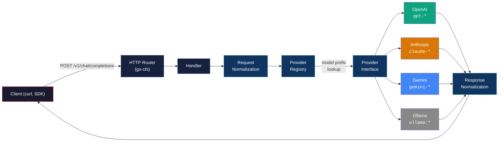
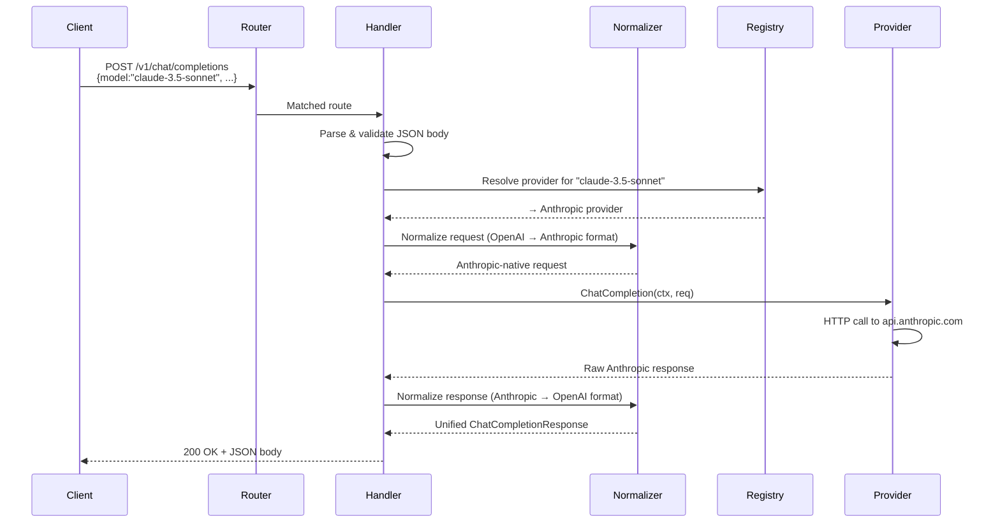
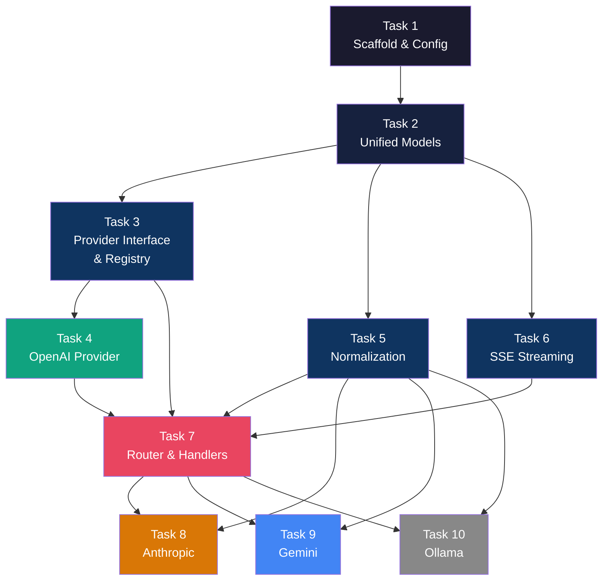

# Phase 1 — Core Gateway (MVP) · Implementation Plan

> **Goal:** Build a fully functional, multi-provider LLM API Gateway in Go that accepts OpenAI-format requests, routes them to OpenAI / Anthropic / Gemini / Ollama, and returns unified responses — both streaming and non-streaming.

---

## Phase 1 Architecture



### Request Flow (Sequence)



---

## Directory Structure

```
LLMGateway/
├── cmd/
│   └── gateway/
│       └── main.go                          # Entrypoint
├── internal/
│   ├── config/
│   │   └── config.go                        # YAML + env var config loader
│   ├── models/
│   │   ├── request.go                       # Unified request types
│   │   ├── response.go                      # Unified response types
│   │   └── errors.go                        # Standard error envelope
│   ├── provider/
│   │   ├── provider.go                      # Provider interface
│   │   ├── registry.go                      # Provider registry + model routing
│   │   ├── openai/
│   │   │   └── openai.go                    # OpenAI provider
│   │   ├── anthropic/
│   │   │   └── anthropic.go                 # Anthropic provider
│   │   ├── gemini/
│   │   │   └── gemini.go                    # Gemini provider
│   │   └── ollama/
│   │       └── ollama.go                    # Ollama provider
│   ├── normalize/
│   │   ├── request.go                       # Inbound request normalization
│   │   └── response.go                      # Outbound response normalization
│   ├── streaming/
│   │   └── sse.go                           # SSE read/write utilities
│   └── router/
│       ├── router.go                        # HTTP route setup (go-chi)
│       └── handlers.go                      # Endpoint handlers
├── configs/
│   ├── gateway.yaml                         # Default config
│   └── gateway.example.yaml                 # Documented example
├── Makefile                                 # build, run, test, lint
└── go.mod                                   # Go module definition
```

---

## Task Breakdown

### Task 1 · Project Scaffold & Config

**Goal:** Bootable Go project that loads config and starts an HTTP server on `:8080`.

| File | Description |
|------|-------------|
| `go.mod` | `[NEW]` Module init (`module github.com/yourusername/llmgateway`) |
| `Makefile` | `[NEW]` `build`, `run`, `test`, `lint` targets |
| `cmd/gateway/main.go` | `[NEW]` Entrypoint — load config → init providers → start server |
| `internal/config/config.go` | `[NEW]` YAML + env var config loader |
| `configs/gateway.yaml` | `[NEW]` Default config file |
| `configs/gateway.example.yaml` | `[NEW]` Documented example config |

**Config structure:**
```yaml
server:
  address: ":8080"

providers:
  openai:
    api_key: "${OPENAI_API_KEY}"
    base_url: "https://api.openai.com/v1"
  anthropic:
    api_key: "${ANTHROPIC_API_KEY}"
    base_url: "https://api.anthropic.com"
  gemini:
    api_key: "${GEMINI_API_KEY}"
    base_url: "https://generativelanguage.googleapis.com"
  ollama:
    base_url: "http://localhost:11434"
```

**Acceptance criteria:**
- `go build ./cmd/gateway` compiles
- `go run ./cmd/gateway --config configs/gateway.yaml` starts and listens on `:8080`
- Config values can be overridden with env vars

---

### Task 2 · Unified Models

**Goal:** Define the canonical request/response types (OpenAI-compatible) that the entire gateway operates on.

| File | Description |
|------|-------------|
| `internal/models/request.go` | `[NEW]` `ChatCompletionRequest`, `Message`, role constants |
| `internal/models/response.go` | `[NEW]` `ChatCompletionResponse`, `Choice`, `Usage`, `StreamChunk` |
| `internal/models/errors.go` | `[NEW]` Standard JSON error envelope |

**Key types:**

```go
// request.go
type ChatCompletionRequest struct {
    Model       string    `json:"model"`
    Messages    []Message `json:"messages"`
    Temperature *float64  `json:"temperature,omitempty"`
    MaxTokens   *int      `json:"max_tokens,omitempty"`
    Stream      bool      `json:"stream,omitempty"`
    Provider    string    `json:"provider,omitempty"` // explicit override
}

type Message struct {
    Role    string `json:"role"`
    Content string `json:"content"`
}
```

```go
// response.go
type ChatCompletionResponse struct {
    ID      string   `json:"id"`
    Object  string   `json:"object"`
    Created int64    `json:"created"`
    Model   string   `json:"model"`
    Choices []Choice `json:"choices"`
    Usage   *Usage   `json:"usage,omitempty"`
}

type StreamChunk struct {
    ID      string        `json:"id"`
    Object  string        `json:"object"`
    Created int64         `json:"created"`
    Model   string        `json:"model"`
    Choices []StreamDelta `json:"choices"`
}
```

```go
// errors.go
type ErrorResponse struct {
    Error ErrorDetail `json:"error"`
}
type ErrorDetail struct {
    Message string `json:"message"`
    Type    string `json:"type"`
    Code    string `json:"code"`
}
```

**Acceptance criteria:**
- All types compile and can be serialized/deserialized to/from JSON
- Error envelope matches OpenAI's error format

---

### Task 3 · Provider Interface & Registry

**Goal:** Define the abstraction every provider must implement, plus a registry that maps model names → providers.

| File | Description |
|------|-------------|
| `internal/provider/provider.go` | `[NEW]` `Provider` interface |
| `internal/provider/registry.go` | `[NEW]` Registry with prefix-based routing |

**Provider interface:**
```go
type Provider interface {
    Name() string
    ChatCompletion(ctx context.Context, req *models.ChatCompletionRequest) (*models.ChatCompletionResponse, error)
    ChatCompletionStream(ctx context.Context, req *models.ChatCompletionRequest) (<-chan *models.StreamChunk, <-chan error)
    ListModels(ctx context.Context) ([]string, error)
    HealthCheck(ctx context.Context) error
}
```

**Registry routing logic:**
| Model prefix | Provider |
|---|---|
| `gpt-*`, `o1-*`, `o3-*` | OpenAI |
| `claude-*` | Anthropic |
| `gemini-*` | Gemini |
| `ollama:*` or fallback | Ollama |

Also supports explicit `"provider": "anthropic"` field in the request to bypass prefix routing.

**Acceptance criteria:**
- `registry.Resolve("gpt-4o")` returns the OpenAI provider
- `registry.Resolve("claude-3.5-sonnet")` returns the Anthropic provider
- Unknown model returns a clear error

---

### Task 4 · OpenAI Provider (First End-to-End)

**Goal:** Implement the first provider to validate the entire pipeline. OpenAI is the simplest because our unified format IS the OpenAI format — minimal transformation.

| File | Description |
|------|-------------|
| `internal/provider/openai/openai.go` | `[NEW]` Full `Provider` implementation for OpenAI |

**Implementation details:**
- Direct HTTP calls to `https://api.openai.com/v1/chat/completions`
- Non-streaming: parse JSON response body
- Streaming: read SSE lines (`data: {...}`) and emit `StreamChunk` on channel
- `ListModels`: `GET /v1/models` → parse and return
- `HealthCheck`: `GET /v1/models` with timeout

**Acceptance criteria:**
- Non-streaming request to GPT-4o returns a valid `ChatCompletionResponse`
- Streaming request emits chunks on the channel and terminates with `[DONE]`
- Requires a valid `OPENAI_API_KEY` env var

---

### Task 5 · Request & Response Normalization

**Goal:** Transform between the unified (OpenAI) format and each provider's native format.

| File | Description |
|------|-------------|
| `internal/normalize/request.go` | `[NEW]` Inbound normalization per provider |
| `internal/normalize/response.go` | `[NEW]` Outbound normalization per provider |

**Normalization mapping:**

| Direction | Anthropic (`/v1/messages`) | Gemini (`/v1beta/models/{model}:generateContent`) | Ollama (`/api/chat`) |
|---|---|---|---|
| **Request** | Extract `system` message → top-level `system` param; `max_tokens` required (default 4096); roles: `user`/`assistant` only | Restructure to `contents[].parts[].text`; map roles to `user`/`model` | Keep `messages` array; `max_tokens` → `options.num_predict` |
| **Response** | `content[0].text` → `choices[0].message.content`; map `stop_reason` → `finish_reason` | `candidates[0].content.parts[0].text` → `choices[0].message.content` | `message.content` → `choices[0].message.content` |
| **Stream** | SSE `content_block_delta` events → `StreamChunk` | SSE chunks → `StreamChunk` | NDJSON lines → `StreamChunk` |

**Acceptance criteria:**
- Unit tests with hardcoded JSON payloads for each provider direction
- Round-trip: unified → provider → unified produces consistent output

---

### Task 6 · SSE Streaming

**Goal:** Utilities to read upstream SSE/NDJSON and write downstream OpenAI-format SSE chunks.

| File | Description |
|------|-------------|
| `internal/streaming/sse.go` | `[NEW]` SSE reader/writer, NDJSON reader |

**Key functions:**
```go
// ReadSSE reads SSE events from an io.Reader, emitting data payloads on a channel
func ReadSSE(ctx context.Context, r io.Reader) <-chan []byte

// ReadNDJSON reads newline-delimited JSON from an io.Reader
func ReadNDJSON(ctx context.Context, r io.Reader) <-chan []byte

// WriteSSE writes an OpenAI-format SSE chunk to an http.ResponseWriter
func WriteSSE(w http.ResponseWriter, chunk *models.StreamChunk) error

// WriteSSEDone writes the final `data: [DONE]` marker
func WriteSSEDone(w http.ResponseWriter) error
```

**Acceptance criteria:**
- `ReadSSE` correctly parses multi-line SSE events (`data: ...`, blank line separator)
- `WriteSSE` produces valid `data: {json}\n\n` output
- NDJSON reader handles Ollama's streaming format

---

### Task 7 · HTTP Router & Handlers

**Goal:** Wire up the endpoints and make the gateway usable end-to-end.

| File | Description |
|------|-------------|
| `internal/router/router.go` | `[NEW]` Route registration with `go-chi` |
| `internal/router/handlers.go` | `[NEW]` Endpoint handlers |

**Endpoints:**

| Method | Path | Handler | Description |
|---|---|---|---|
| `POST` | `/v1/chat/completions` | `ChatCompletionHandler` | Route to provider, return response or stream |
| `GET` | `/v1/models` | `ListModelsHandler` | Aggregate models from all configured providers |
| `GET` | `/health` | `HealthHandler` | Liveness probe (`{"status":"ok"}`) |

**`ChatCompletionHandler` flow:**
1. Parse JSON body → `ChatCompletionRequest`
2. Validate required fields (`model`, `messages`)
3. `registry.Resolve(req.Model)` → get provider
4. If `req.Stream` → call `ChatCompletionStream`, write SSE chunks
5. Else → call `ChatCompletion`, write JSON response

**Acceptance criteria:**
- `curl POST /v1/chat/completions` with a GPT model returns a valid JSON response
- Streaming variant returns SSE events ending with `[DONE]`
- `GET /v1/models` returns a list
- `GET /health` returns `200`

---

### Task 8 · Anthropic Provider

**Goal:** Second provider — validates the normalization layer.

| File | Description |
|------|-------------|
| `internal/provider/anthropic/anthropic.go` | `[NEW]` Full `Provider` implementation for Anthropic |

**API details:**
- Endpoint: `POST https://api.anthropic.com/v1/messages`
- Headers: `x-api-key`, `anthropic-version: 2023-06-01`, `Content-Type: application/json`
- Request: `{ model, messages, max_tokens, system?, stream? }`
- Streaming: SSE with event types `content_block_delta` (text delta), `message_stop`
- `ListModels`: Return hardcoded list (Anthropic has no list endpoint)
- `HealthCheck`: Small request with 1 max_token

**Acceptance criteria:**
- Non-streaming request to Claude returns a valid unified response
- Streaming works and correctly maps deltas

---

### Task 9 · Gemini Provider

**Goal:** Third provider — exercises the most complex normalization.

| File | Description |
|------|-------------|
| `internal/provider/gemini/gemini.go` | `[NEW]` Full `Provider` implementation for Gemini |

**API details:**
- Endpoint: `POST https://generativelanguage.googleapis.com/v1beta/models/{model}:generateContent?key={api_key}`
- Streaming: `POST .../{model}:streamGenerateContent?alt=sse&key={api_key}`
- Request body: `{ contents: [{ role, parts: [{ text }] }], generationConfig: { temperature, maxOutputTokens } }`
- Role mapping: `assistant` → `model`
- `system` message → `systemInstruction` field
- `ListModels`: `GET /v1beta/models?key={api_key}`

**Acceptance criteria:**
- Non-streaming and streaming requests both produce valid unified responses
- Role mapping and content restructuring work correctly

---

### Task 10 · Ollama Provider

**Goal:** Fourth provider — local model support.

| File | Description |
|------|-------------|
| `internal/provider/ollama/ollama.go` | `[NEW]` Full `Provider` implementation for Ollama |

**API details:**
- Endpoint: `POST http://localhost:11434/api/chat`
- Request: `{ model, messages: [{role, content}], stream, options: { num_predict, temperature } }`
- Streaming: NDJSON (one JSON object per line), not SSE
- `ListModels`: `GET /api/tags` → parse model names
- `HealthCheck`: `GET /` (returns 200 if running)

**Acceptance criteria:**
- Works against a locally running Ollama instance
- Streaming correctly reads NDJSON format
- `max_tokens` → `options.num_predict` mapping works

---

## Dependency Graph



> Tasks 4, 5, 6 can be worked on in parallel once Task 3 is done.  
> Tasks 8, 9, 10 can be worked on in parallel once Task 7 is done.

---

## File Summary

| # | File | Task | Type |
|---|------|------|------|
| 1 | `go.mod` | T1 | `[NEW]` |
| 2 | `Makefile` | T1 | `[NEW]` |
| 3 | `cmd/gateway/main.go` | T1 | `[NEW]` |
| 4 | `internal/config/config.go` | T1 | `[NEW]` |
| 5 | `configs/gateway.yaml` | T1 | `[NEW]` |
| 6 | `configs/gateway.example.yaml` | T1 | `[NEW]` |
| 7 | `internal/models/request.go` | T2 | `[NEW]` |
| 8 | `internal/models/response.go` | T2 | `[NEW]` |
| 9 | `internal/models/errors.go` | T2 | `[NEW]` |
| 10 | `internal/provider/provider.go` | T3 | `[NEW]` |
| 11 | `internal/provider/registry.go` | T3 | `[NEW]` |
| 12 | `internal/provider/openai/openai.go` | T4 | `[NEW]` |
| 13 | `internal/normalize/request.go` | T5 | `[NEW]` |
| 14 | `internal/normalize/response.go` | T5 | `[NEW]` |
| 15 | `internal/streaming/sse.go` | T6 | `[NEW]` |
| 16 | `internal/router/router.go` | T7 | `[NEW]` |
| 17 | `internal/router/handlers.go` | T7 | `[NEW]` |
| 18 | `internal/provider/anthropic/anthropic.go` | T8 | `[NEW]` |
| 19 | `internal/provider/gemini/gemini.go` | T9 | `[NEW]` |
| 20 | `internal/provider/ollama/ollama.go` | T10 | `[NEW]` |

**Total: 20 new files**

---

## Verification Plan

### Automated Tests

Unit tests will be placed alongside each package (e.g. `internal/models/request_test.go`).

```powershell
# Run all tests with race detection
go test ./... -v -count=1 -race
```

**Test coverage per task:**

| Task | Tests | What's verified |
|---|---|---|
| T1 | `config/config_test.go` | YAML parsing, env var override, missing file error |
| T2 | `models/request_test.go`, `models/response_test.go` | JSON marshal/unmarshal round-trips |
| T3 | `provider/registry_test.go` | Prefix routing, explicit provider, unknown model error |
| T4 | `provider/openai/openai_test.go` | Mock HTTP server (`httptest`) for chat + stream + models |
| T5 | `normalize/request_test.go`, `normalize/response_test.go` | Hardcoded JSON fixtures per provider direction |
| T6 | `streaming/sse_test.go` | SSE parsing, NDJSON parsing, SSE writing |
| T7 | `router/handlers_test.go` | Full handler tests with mock providers |
| T8–10 | `provider/{name}/{name}_test.go` | Mock HTTP server per provider |

### Manual Smoke Test

After all tasks are complete, run the gateway and test manually:

```powershell
# 1. Start the gateway
go run ./cmd/gateway --config configs/gateway.yaml

# 2. Health check
curl http://localhost:8080/health
# Expected: {"status":"ok"}

# 3. List models
curl http://localhost:8080/v1/models
# Expected: JSON array of model names from all configured providers

# 4. Non-streaming chat (OpenAI)
curl -X POST http://localhost:8080/v1/chat/completions ^
  -H "Content-Type: application/json" ^
  -d "{\"model\":\"gpt-4o\",\"messages\":[{\"role\":\"user\",\"content\":\"Say hello\"}]}"
# Expected: JSON response with choices[0].message.content

# 5. Streaming chat (OpenAI)
curl -N -X POST http://localhost:8080/v1/chat/completions ^
  -H "Content-Type: application/json" ^
  -d "{\"model\":\"gpt-4o\",\"messages\":[{\"role\":\"user\",\"content\":\"Say hello\"}],\"stream\":true}"
# Expected: SSE events ending with data: [DONE]

# 6. Repeat steps 4-5 with other providers:
#    - model: "claude-3-5-sonnet-20241022" (Anthropic)
#    - model: "gemini-2.0-flash" (Gemini)
#    - model: "ollama:llama3" (Ollama, requires local Ollama)
```
