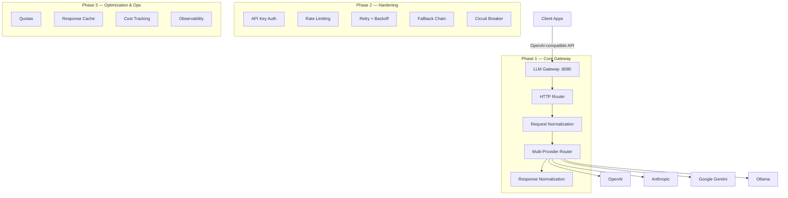
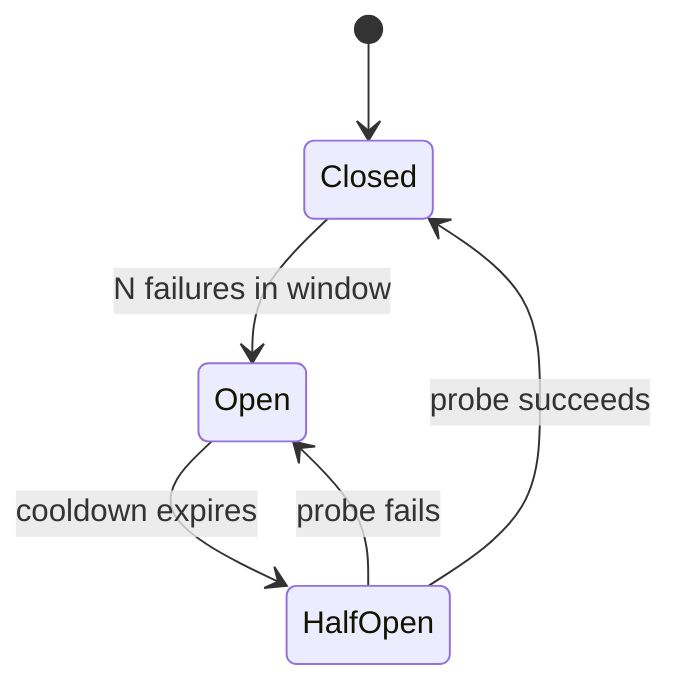

# LLM Gateway — Implementation Plan (Core-First)

A high-performance LLM API Gateway in Go, restructured to **ship a working core first**, then layer on advanced features incrementally.

---

## Architecture Overview



---

## Directory Structure

```
LLMGateway/
├── cmd/gateway/main.go              # Entrypoint
├── internal/
│   ├── config/config.go             # YAML + env var config loader
│   ├── models/
│   │   ├── request.go               # Unified request types
│   │   ├── response.go              # Unified response types
│   │   └── errors.go                # Standard error envelope
│   ├── provider/
│   │   ├── provider.go              # Provider interface
│   │   ├── registry.go              # Provider registry + model routing
│   │   ├── openai/openai.go
│   │   ├── anthropic/anthropic.go
│   │   ├── gemini/gemini.go
│   │   └── ollama/ollama.go
│   ├── middleware/
│   │   ├── chain.go                 # Middleware composition
│   │   ├── auth.go                  # API key auth              (Phase 2)
│   │   ├── quota.go                 # Per-key usage quotas      (Phase 3)
│   │   ├── ratelimit.go             # Token-bucket rate limiter (Phase 2)
│   │   ├── retry.go                 # Retry + exp. backoff      (Phase 2)
│   │   ├── fallback.go              # Fallback provider chain   (Phase 2)
│   │   ├── circuitbreaker.go        # Circuit breaker           (Phase 2)
│   │   ├── cache.go                 # Response cache (LRU)      (Phase 3)
│   │   ├── cost.go                  # Token-based cost tracking (Phase 3)
│   │   └── logging.go               # Structured request log    (Phase 2)
│   ├── normalize/
│   │   ├── request.go               # Inbound request normalization
│   │   └── response.go              # Outbound response normalization
│   ├── router/
│   │   ├── router.go                # HTTP route setup
│   │   └── handlers.go              # Endpoint handlers
│   ├── streaming/sse.go             # SSE read/write utilities
│   └── observability/               # (Phase 3)
│       ├── metrics.go
│       ├── tracing.go
│       └── requestid.go
├── configs/
│   ├── gateway.yaml                 # Default config
│   └── gateway.example.yaml         # Documented example
├── deployments/                     # (Phase 3)
│   ├── Dockerfile
│   └── docker-compose.yml
├── Makefile
├── go.mod
└── README.md
```

---

## Phase 1 — Core Gateway (MVP)

> **Goal:** Accept an OpenAI-format request, route it to the correct provider, and return a unified response. Streaming and non-streaming.

### 1.1 · Project Scaffold & Config

- `cmd/gateway/main.go` — bootstrap, load config, start HTTP server
- `internal/config/config.go` — YAML + env var loader (`gopkg.in/yaml.v3`)
- `configs/gateway.yaml` — minimal config: listen address, provider API keys
- `go.mod`, `Makefile` (`build`, `run`, `test` targets)

### 1.2 · Unified Models

Define the canonical request/response types that the entire gateway operates on.

```go
// internal/models/request.go
type ChatCompletionRequest struct {
    Model       string    `json:"model"`
    Messages    []Message `json:"messages"`
    Temperature *float64  `json:"temperature,omitempty"`
    MaxTokens   *int      `json:"max_tokens,omitempty"`
    Stream      bool      `json:"stream,omitempty"`
    Provider    string    `json:"provider,omitempty"` // explicit routing
}
```

```go
// internal/models/response.go
type ChatCompletionResponse struct {
    ID      string   `json:"id"`
    Object  string   `json:"object"`
    Created int64    `json:"created"`
    Model   string   `json:"model"`
    Choices []Choice `json:"choices"`
    Usage   *Usage   `json:"usage,omitempty"`
}
```

- `internal/models/errors.go` — standard JSON error envelope

### 1.3 · Provider Interface & Registry

```go
type Provider interface {
    Name() string
    ChatCompletion(ctx context.Context, req *models.ChatCompletionRequest) (*models.ChatCompletionResponse, error)
    ChatCompletionStream(ctx context.Context, req *models.ChatCompletionRequest) (<-chan *models.StreamChunk, <-chan error)
    ListModels(ctx context.Context) ([]string, error)
    HealthCheck(ctx context.Context) error
}
```

- `internal/provider/registry.go` — model-prefix → provider mapping (`gpt-*` → OpenAI, `claude-*` → Anthropic, etc.)

### 1.4 · OpenAI Provider (First Provider)

Implement the full `Provider` interface for OpenAI since it's the simplest (our unified format IS the OpenAI format — minimal transformation needed). This validates the entire pipeline end-to-end.

- `internal/provider/openai/openai.go`

### 1.5 · Request & Response Normalization

Transform between the unified format and each provider's native format.

| Direction | Anthropic | Gemini | Ollama |
|-----------|-----------|--------|--------|
| **Request** | `system` → top-level param, map `max_tokens` (required) | `assistant` → `model`, restructure `contents[].parts[]` | Flatten messages, `max_tokens` → `num_predict` |
| **Response** | `content[].text` → `choices[].message.content` | `candidates[].content.parts[].text` → `choices[].message.content` | `message.content` → `choices[].message.content` |

- `internal/normalize/request.go`
- `internal/normalize/response.go`

### 1.6 · SSE Streaming

- `internal/streaming/sse.go` — read upstream SSE/NDJSON, write downstream OpenAI-format SSE chunks

### 1.7 · HTTP Router & Handlers

Core endpoints only:

| Method | Path | Description |
|--------|------|-------------|
| `POST` | `/v1/chat/completions` | Chat (streaming & non-streaming) |
| `GET`  | `/v1/models` | Aggregated model list |
| `GET`  | `/health` | Liveness probe |

- `internal/router/router.go`
- `internal/router/handlers.go`

### 1.8 · Remaining Providers

Add the other three providers, in this order:

1. **Anthropic** — `internal/provider/anthropic/anthropic.go`
2. **Gemini** — `internal/provider/gemini/gemini.go`
3. **Ollama** — `internal/provider/ollama/ollama.go`

Each provider only needs to implement the `Provider` interface; normalization is shared.

### Phase 1 Milestone

At this point you have a **fully functional, multi-provider LLM gateway** that:
- Accepts OpenAI-format requests
- Routes to any of 4 providers
- Returns unified responses (streaming + non-streaming)
- Can be tested end-to-end with `curl`

---

## Phase 2 — Hardening

> **Goal:** Make the gateway production-safe with auth, rate limiting, and reliability.

### 2.1 · Middleware Chain

- `internal/middleware/chain.go` — composable middleware stack
- `internal/middleware/logging.go` — structured request logging (`log/slog`)

### 2.2 · API Key Authentication

- `internal/middleware/auth.go`
- Keys from config, reject with `401` on mismatch

### 2.3 · Rate Limiting

- `internal/middleware/ratelimit.go`
- Token-bucket per API key (requests/min, tokens/min)
- `429 Too Many Requests` + `Retry-After` header

### 2.4 · Reliability Stack

#### Retry with Backoff
- Max retries: configurable (default 3)
- Exponential backoff with jitter (500ms → 1s → 2s + jitter)
- Only retries on 5xx, timeouts, connection resets

#### Fallback Chain
- Ordered list of alternative providers per model group
- Auto-tries next provider on primary failure

#### Circuit Breaker
- Per-provider (closed → open → half-open)
- Opens after N consecutive failures in a window
- Auto-recovers with health probes



- `internal/middleware/retry.go`
- `internal/middleware/fallback.go`
- `internal/middleware/circuitbreaker.go`

---

## Phase 3 — Optimization & Ops

> **Goal:** Add cost controls, caching, full observability, and deployment packaging.

### 3.1 · Quotas

- `internal/middleware/quota.go`
- Per-key: max requests/day, max tokens/day, max cost/month
- `429` when exhausted, counters reset on configurable intervals

### 3.2 · Cost Tracking

- `internal/middleware/cost.go`
- Parse token usage from every response, look up per-model pricing
- Accumulate per key / provider / model

### 3.3 · Response Caching

- `internal/middleware/cache.go`
- In-memory LRU, keyed by `hash(model + messages + temperature)`
- Configurable TTL, bypassed for streaming

### 3.4 · Observability

- `internal/observability/metrics.go` — Prometheus counters/histograms
- `internal/observability/requestid.go` — UUID per request → `X-Request-Id` → all logs
- `internal/observability/tracing.go` — OpenTelemetry (optional)

| Metric | Type | Labels |
|--------|------|--------|
| `gateway_requests_total` | Counter | `provider`, `model`, `status` |
| `gateway_request_duration_seconds` | Histogram | `provider`, `model` |
| `gateway_tokens_total` | Counter | `provider`, `model`, `direction` |
| `gateway_cost_dollars_total` | Counter | `provider`, `model`, `api_key` |
| `gateway_cache_hits_total` | Counter | |

### 3.5 · Admin Endpoints

| Method | Path | Description |
|--------|------|-------------|
| `GET`  | `/metrics` | Prometheus scrape |
| `GET`  | `/admin/stats` | Per-key usage & cost |
| `POST` | `/admin/config/reload` | Hot-reload config |

### 3.6 · Deployment

- `deployments/Dockerfile` — multi-stage build
- `deployments/docker-compose.yml` — gateway + Prometheus + Grafana
- `README.md` — quickstart, config reference

---

## Go Dependencies

| Package | Purpose | Phase |
|---------|---------|-------|
| `gopkg.in/yaml.v3` | YAML config parsing | 1 |
| `github.com/go-chi/chi/v5` | HTTP routing | 1 |
| `github.com/google/uuid` | Request IDs | 2 |
| `golang.org/x/time/rate` | Token-bucket rate limiter | 2 |
| `github.com/prometheus/client_golang` | Prometheus metrics | 3 |

---

## Build Order Summary

| Step | What You Ship | Est. Files |
|------|--------------|-----------|
| **P1.1** | Scaffold + config + models | ~6 |
| **P1.2** | Provider interface + registry + OpenAI provider | ~4 |
| **P1.3** | Normalization + SSE streaming | ~3 |
| **P1.4** | HTTP router + handlers (end-to-end works!) | ~3 |
| **P1.5** | Anthropic, Gemini, Ollama providers | ~3 |
| ✅ **MVP** | **Fully working multi-provider gateway** | **~19** |
| **P2.1** | Middleware chain + logging + auth | ~3 |
| **P2.2** | Rate limiting | ~1 |
| **P2.3** | Retry + fallback + circuit breaker | ~3 |
| **P3.1** | Quotas + cost tracking + caching | ~3 |
| **P3.2** | Observability + admin endpoints | ~4 |
| **P3.3** | Dockerfile, docker-compose, README | ~4 |

---

## Verification Plan

### Automated Tests
```powershell
go test ./... -v -count=1 -race
```
- Unit tests per provider (mock HTTP backends via `httptest`)
- Unit tests for request/response normalization
- Integration test: full gateway with mock providers

### Manual Smoke Test (after Phase 1)
```powershell
# Start gateway
go run ./cmd/gateway --config configs/gateway.yaml

# Non-streaming
curl -X POST http://localhost:8080/v1/chat/completions ^
  -H "Content-Type: application/json" ^
  -d "{\"model\":\"gpt-4o\",\"messages\":[{\"role\":\"user\",\"content\":\"Hello\"}]}"

# Streaming
curl -X POST http://localhost:8080/v1/chat/completions ^
  -H "Content-Type: application/json" ^
  -d "{\"model\":\"gpt-4o\",\"messages\":[{\"role\":\"user\",\"content\":\"Hello\"}],\"stream\":true}"

# List models
curl http://localhost:8080/v1/models

# Health check
curl http://localhost:8080/health
```
