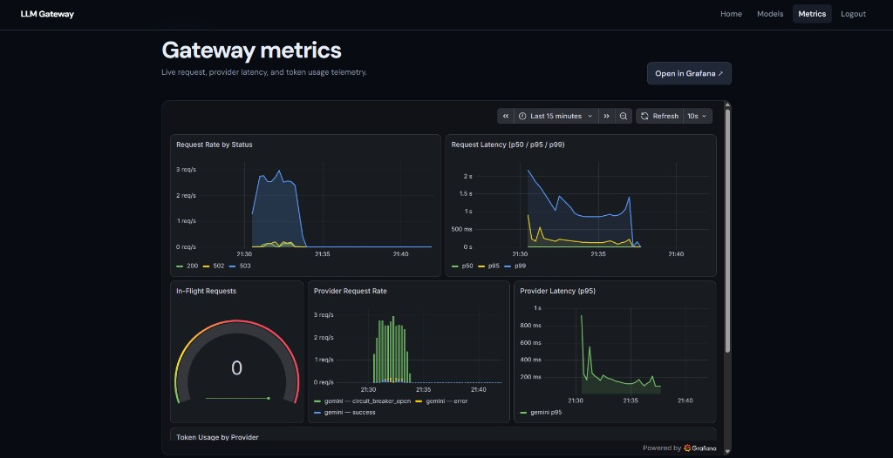
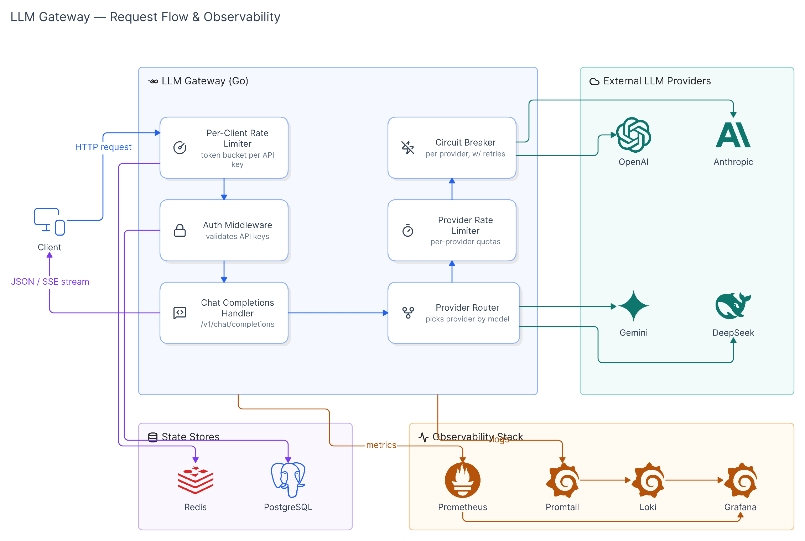

# LLM Gateway

A single API that talks to OpenAI, Anthropic, Gemini, and DeepSeek — so you don't have to integrate each one separately.

Send every request in one common format; the gateway translates it for whichever provider you pick, tracks usage, and keeps things running smoothly even when a provider has issues.



## Why use it

- **One API for every provider** — write your integration once, switch models without changing client code.
- **Stays up when a provider doesn't** — a circuit breaker detects a failing provider and fails fast instead of hanging your requests.
- **Protects you from surprise bills** — rate limiting per user and per provider keeps usage under control.
- **Built-in login & API keys** — sign up, log in, and manage your own API keys out of the box.
- **See what's happening** — metrics and dashboards show request rates, latency, and errors in real time.

## How it works



## Quick start

**You'll need:** Docker, Docker Compose, and API keys for the providers you want to use.

```bash
git clone <repo_url>
cd llmgateway
cp .env.example .env        # add your OPENAI_API_KEY / ANTHROPIC_API_KEY etc.
make docker-up               # starts the gateway, Postgres, Redis, and dashboards
make migrate-up               # sets up the database
```

Then send a request:

```bash
curl -X POST localhost:8080/v1/chat/completions \
  -H "Authorization: Bearer <gateway-api-key>" \
  -H "Content-Type: application/json" \
  -d '{
    "model": "gpt-3.5-turbo",
    "messages": [{"role": "user", "content": "Hello!"}]
  }'
```

**What's running:**
| Service | Address |
| --- | --- |
| Gateway | `localhost:8080` |
| Grafana dashboards | `http://localhost:3000` (login: admin/admin) |
| Prometheus | `http://localhost:9090` |

## Built with

Go · PostgreSQL · Redis · Prometheus · Grafana · Loki · Docker

## License

MIT License
